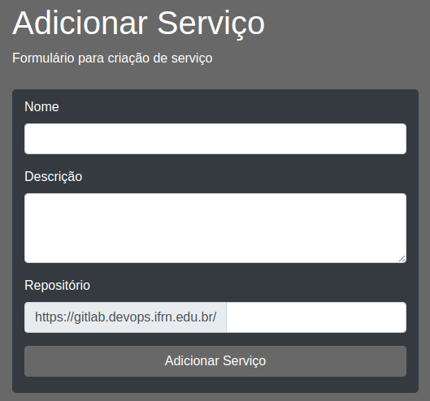
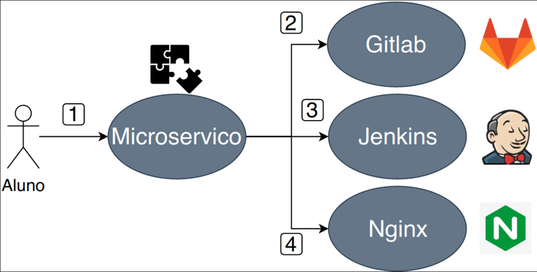
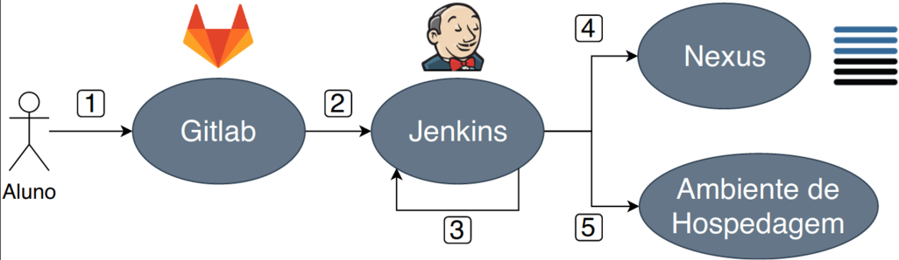
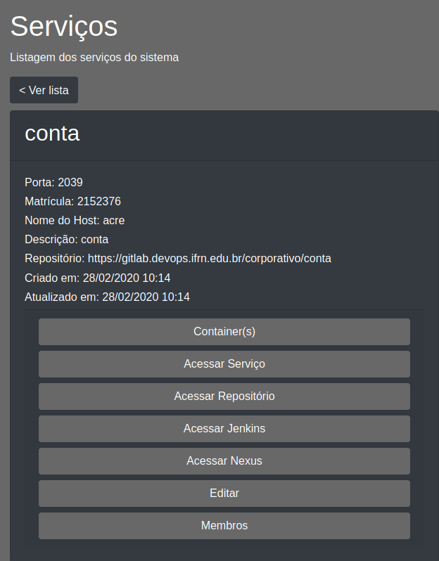
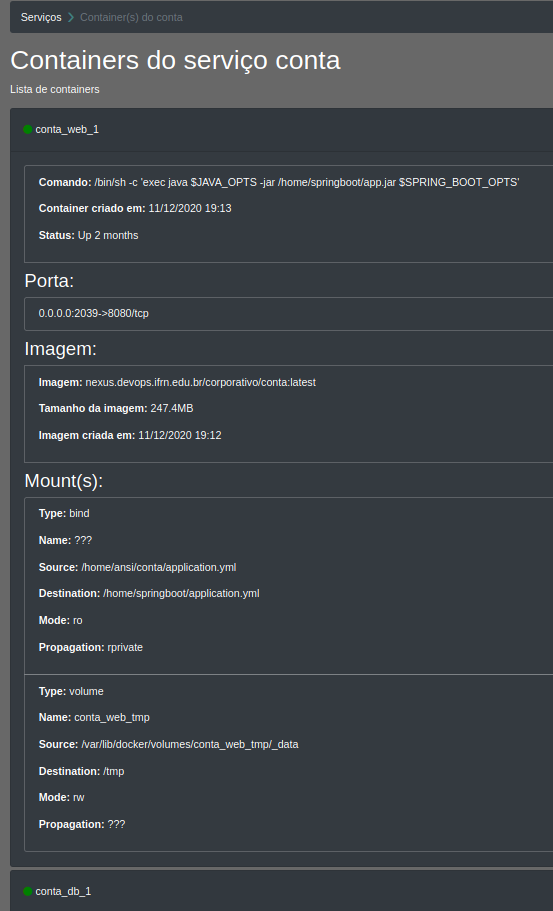
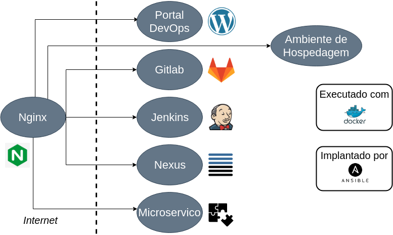

## Introdução 

O CDLearning é uma ambiente de apoio ao aprendizado da [Entrega Contínua de Software](https://pt.wikipedia.org/wiki/Entrega_cont%C3%ADnua) (ECS), um dos pilares fundamentais de DevOps. O ambiente lida com desafios de ensino DevOps reportados pela comunidade,  tais  como:  
- promover  a  integração  de  ferramentas  de  ECS  para  diminuir  a carga de trabalho de professores;
- mitigar a dificuldade inicial de configuração de pipeline ECS de projetos através da oferta de configurações iniciais de pipeline que podem ser usados e estendidos pelos estudantes.

O ambiente disponibiliza os seguintes serviços:

- Serviço de Repositório de Código Fonte ([GitLab](https://about.gitlab.com/))
- Serviço de Execução de _Pipeline_ ([Jenkins](https://www.jenkins.io/))
- Serviço de Armazenamento de Artefatos ([Nexus](https://www.sonatype.com/))
- Serviço de Conteinização ([Docker](https://www.docker.com/))

## Caso de Uso do Cadastro de um Sistema

 
   

 
   

## Caso de Uso do Pipeline de Construção de um Sistema

 
   

## Detalhe de um serviço

 
   

## Detalhe dos containeres de um serviço

 
   

## Arquitetura Geral do CDLearning

 
   

